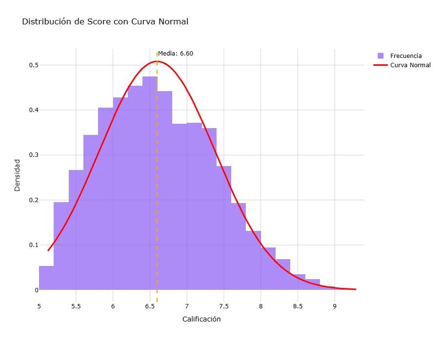
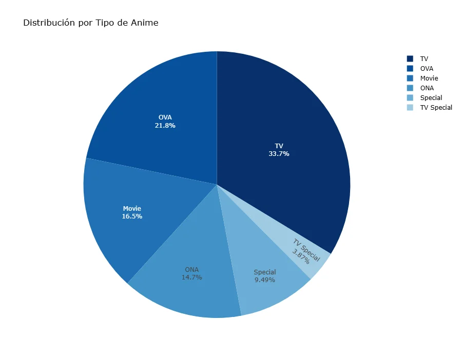
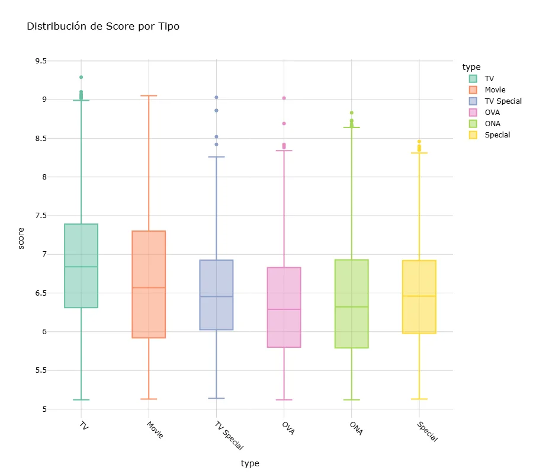
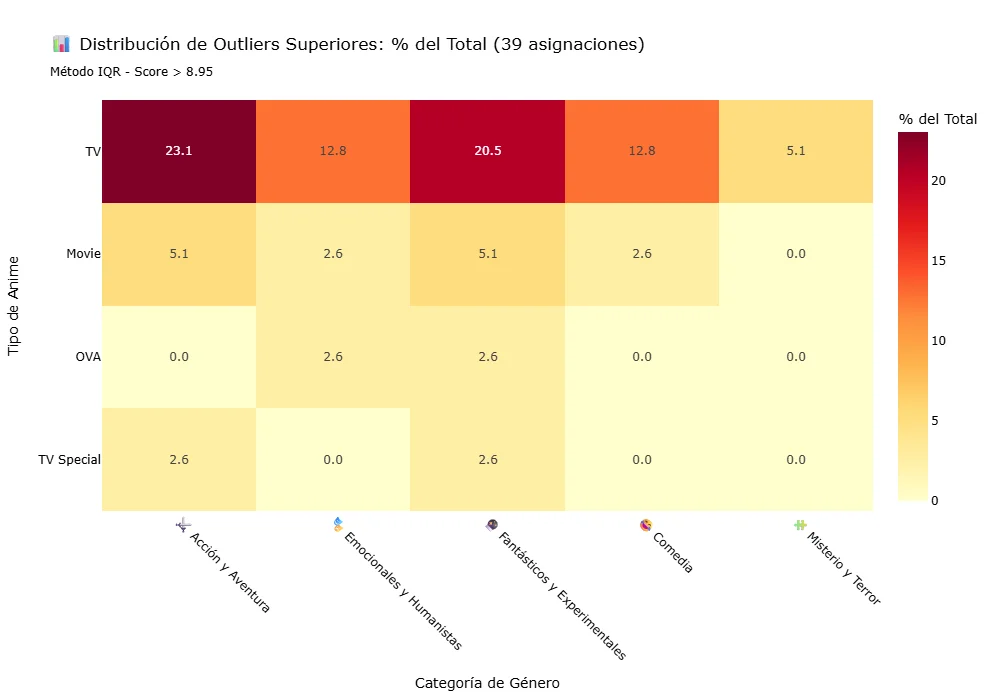
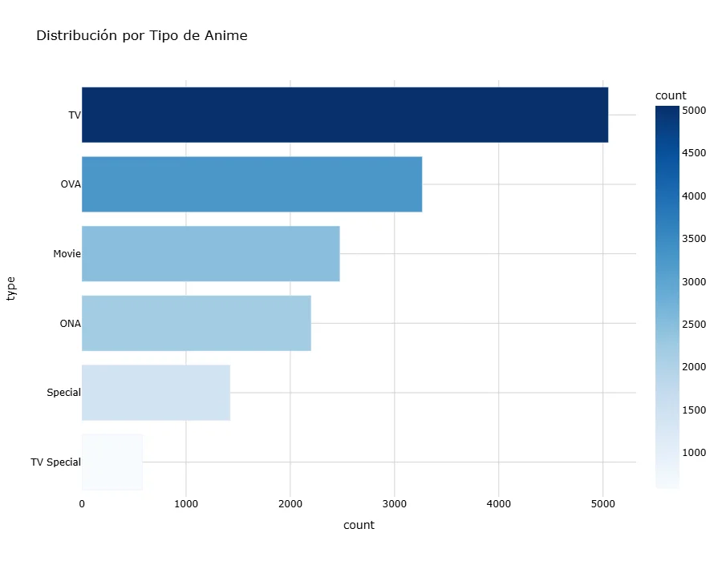
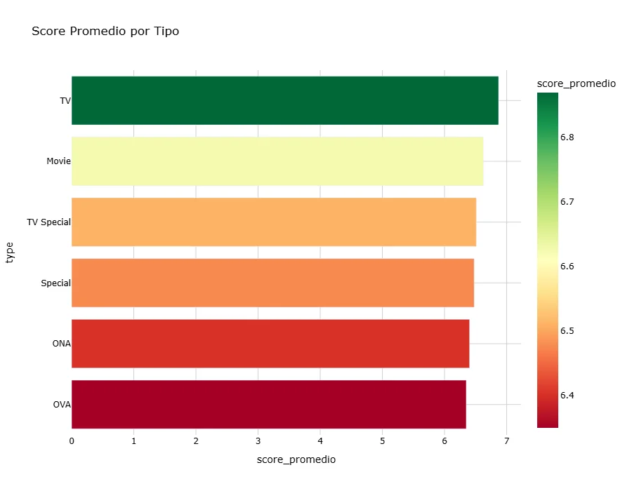
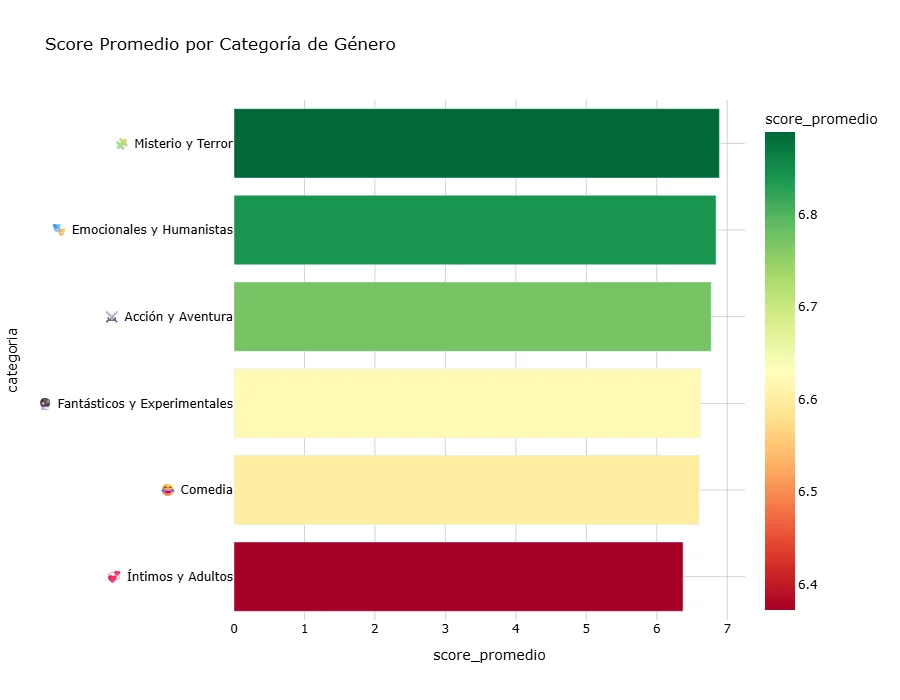
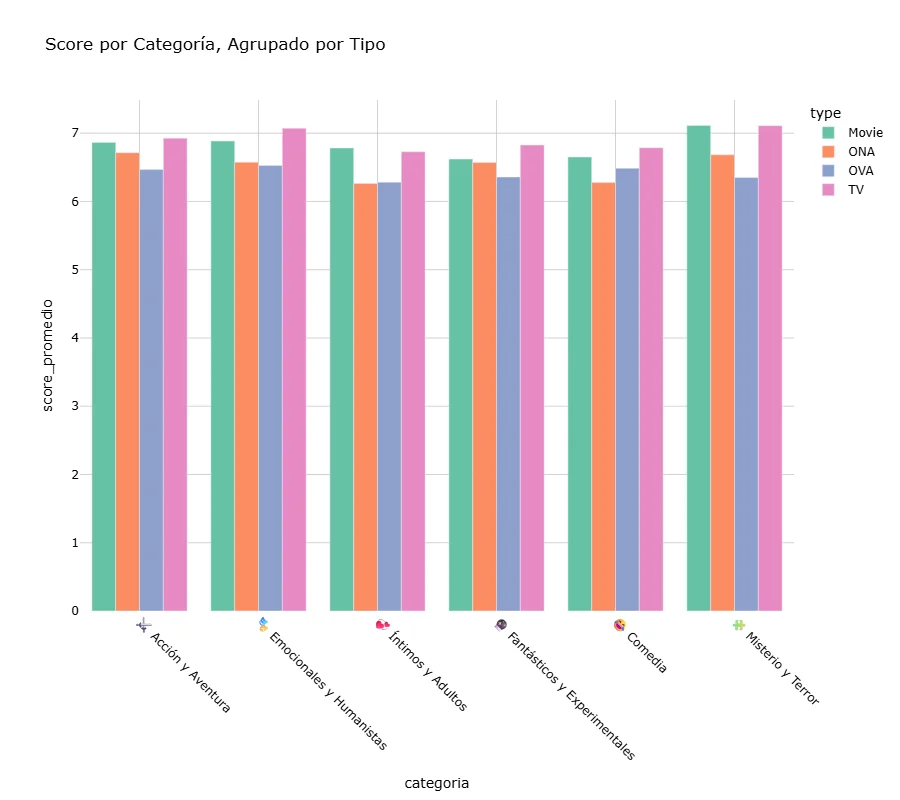
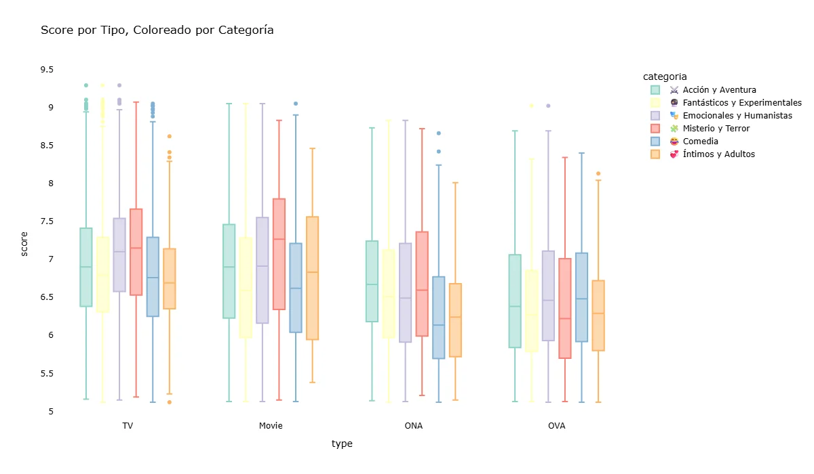

# 🎬 Anime Success Factors: Exploratory Data Analysis

[](https://www.python.org/)
[](https://pandas.pydata.org/)
[](https://plotly.com/)
[](LICENSE)

> **Análisis exploratorio de datos (EDA) sobre 15,000 anime de MyAnimeList para identificar qué factores influyen en el éxito de un anime.**

---

## 📊 Descripción del Proyecto

Este proyecto analiza cómo el **formato** (TV, Movie, OVA, ONA) y la **categoría de género** interactúan para influir en las **calificaciones** de anime en MyAnimeList. A través de análisis univariado, bivariado y multivariado, se identifican patrones, combinaciones ganadoras y factores de éxito.

### 🎯 Objetivos

1. ¿El formato afecta el score de manera independiente?
2. ¿Las categorías de género influyen en las calificaciones?
3. ¿Existen interacciones entre formato y categoría?
4. ¿Qué patrones caracterizan a los anime excepcionales?

---

## 🗂️ Estructura del Proyecto

```
anime-eda-project/
│
├── data/
│   ├── raw/                           # Dataset original
│   │   └── anime_dataset_raw.csv      # 15,000 anime de MyAnimeList
│   └── processed/                     # Datasets procesados
│       ├── anime_clean.csv            # Dataset limpio
│       └── anime_categorized.csv      # Dataset con categorías
│
├── notebooks/
│   └── anime_eda_analysis.ipynb       # Notebook principal del análisis
│
├── visualizations/                    # 12 visualizaciones del EDA
│   ├── 01_score_distribution.png
│   ├── 02_type_distribution_bar.png
│   ├── 03_category_distribution_pie.png
│   ├── 09_type_category_heatmap.png
│   └── ...
│
├── docs/                              # Documentación adicional
│
├── requirements.txt                   # Dependencias de Python
├── .gitignore                         # Archivos ignorados por Git
└── README.md                          # Este archivo
```

---

## 📈 Resultados Clave

### 1️⃣ Distribución de Scores

<p align="center">
  
</p>

**Insights:**
- La distribución es **ligeramente sesgada a la izquierda** (scores más bajos)
- **Media: 6.60** | **Mediana: 6.70**
- Asimetría: -0.18 (cola izquierda más larga)

---

### 2️⃣ Análisis por Formato (Type)

<p align="center">
  
  
</p>

**Insights:**
- **TV domina** con 33.7% del dataset
- **TV tiene el score promedio más alto** (6.91)
- **OVA y ONA tienen los scores más bajos** (6.33 y 6.36)

---

### 3️⃣ Análisis por Categoría de Género

<p align="center">
  
  
</p>

**Categorías temáticas (6 grupos):**
- 🎭 Emocionales y Humanistas (Drama, Romance, Slice of Life)
- ⚔️ Acción y Aventura
- 🧩 Misterio y Terror
- 🔮 Fantásticos y Experimentales
- 💞 Íntimos y Adultos
- 😂 Comedia

**Insights:**
- **Acción y Aventura** domina en volumen (26.6%)
- **Misterio y Terror** tiene el score más alto (7.04)
- **Íntimos y Adultos** tiene el score más bajo (6.41)

---

### 4️⃣ Análisis Multivariado: Type × Categoría

<p align="center">
  
</p>

**Combinaciones ganadoras (Score > 7.0):**
1. 🏆 **Movie + Misterio y Terror**: 7.11
2. 🏆 **TV + Misterio y Terror**: 7.11
3. 🏆 **TV + Emocionales y Humanistas**: 7.07

**Combinaciones perdedoras (Score < 6.4):**
- ❌ OVA + Misterio y Terror: 6.35
- ❌ OVA + Íntimos y Adultos: 6.28
- ❌ ONA + Íntimos y Adultos: 6.26

---

### 5️⃣ Análisis de Outliers (Masterpieces)

<p align="center">
  
</p>

**Insights:**
- **TV produce el 72% de los masterpieces** (scores ≥ 8.95)
- **Acción y Aventura genera el 23.1%** de los outliers superiores
- **Fantásticos y Experimentales** también destaca (20.5%)

---

## 🔬 Metodología

### Procesamiento de Datos

1. **Limpieza:**
   - Eliminación de columnas con >20% de valores nulos
   - Imputación de valores faltantes (media para numéricos, moda para categóricos)
   - Eliminación de duplicados

2. **Categorización:**
   - Reducción de 22 géneros a 6 categorías temáticas
   - Basado en análisis semántico y características narrativas

3. **Análisis:**
   - Univariado: Distribuciones, estadísticos descriptivos
   - Bivariado: Relaciones Type-Score, Categoría-Score
   - Multivariado: Interacciones Type × Categoría
   - Outliers: Identificación de masterpieces (método IQR)

---

## 🛠️ Tecnologías Utilizadas

| Tecnología | Propósito |
|------------|-----------|
|  | Lenguaje principal |
|  | Manipulación de datos |
|  | Operaciones numéricas |
|  | Visualizaciones interactivas |
|  | Notebook interactivo |

---

## 🚀 Cómo Ejecutar el Proyecto

### Prerrequisitos

- Python 3.11 o superior
- pip (gestor de paquetes de Python)

### Instalación

1. **Clonar el repositorio:**
   ```bash
   git clone https://github.com/TU_USUARIO/anime-eda-project.git
   cd anime-eda-project
   ```

2. **Crear entorno virtual (recomendado):**
   ```bash
   python -m venv venv
   
   # En Windows:
   venv\Scripts\activate
   
   # En macOS/Linux:
   source venv/bin/activate
   ```

3. **Instalar dependencias:**
   ```bash
   pip install -r requirements.txt
   ```

4. **Ejecutar el notebook:**
   ```bash
   jupyter notebook notebooks/anime_eda_analysis.ipynb
   ```

---

## 📊 Datasets

### Dataset Original
- **Archivo:** `data/raw/anime_dataset_raw.csv`
- **Registros:** 15,000 anime
- **Columnas:** 24 features
- **Fuente:** MyAnimeList (MAL)

### Datasets Procesados

#### 1. anime_clean.csv
- **Registros:** ~14,XXX (después de limpieza)
- **Columnas:** XX features
- **Procesamiento:** Limpieza básica, imputación, eliminación de duplicados

#### 2. anime_categorized.csv
- **Registros:** ~14,XXX
- **Columnas:** XX features + `categoria`
- **Nueva columna:** `categoria` (6 grupos temáticos)
- **Uso:** Análisis multivariado Type × Categoría

---

## 📸 Galería de Visualizaciones

<details>
<summary>Ver todas las visualizaciones (12 gráficas)</summary>

| # | Visualización | Descripción |
|---|---------------|-------------|
| 1 |  | Distribución de scores con curva normal |
| 2 |  | Distribución por tipo (barras) |
| 3 |  | Distribución por tipo (torta) |
| 4 |  | Distribución por categoría (barras) |
| 5 |  | Distribución por categoría (torta) |
| 6 |  | Cantidad de categorías por anime |
| 7 |  | Score promedio por tipo |
| 8 |  | Boxplot de score por tipo |
| 9 |  | Score promedio por categoría |
| 10 |  | Boxplot de score por categoría |
| 11 |  | Heatmap Type × Categoría |
| 12 |  | Barras agrupadas por tipo |
| 13 |  | Boxplot multivariable |
| 14 |  | Heatmap de outliers superiores |

</details>

---

## 📝 Conclusiones

### ✅ Hallazgos Principales

1. **TV es el formato premium:** Score promedio más alto (6.91) y genera el 72% de los masterpieces
2. **Misterio y Terror domina en calidad:** Score promedio de 7.04, el más alto de todas las categorías
3. **Interacciones Type × Categoría son significativas:** Ciertas combinaciones funcionan mejor que otras
4. **Movie + Misterio es la fórmula ganadora:** Score de 7.11, ideal para producciones cinematográficas
5. **Íntimos y Adultos tiene techo estructural:** Score consistentemente bajo en todos los formatos

### 🎯 Recomendaciones para Productores

**Si tu objetivo es calidad:**
- Produce **TV Series** de **Misterio y Terror**
- Considera **Movies** de **Fantásticos y Experimentales**
- Evita **OVA** y **ONA** para géneros premium

**Si tu objetivo es volumen:**
- Enfócate en **Acción y Aventura** (alta demanda)
- Usa formato **TV** (mayor alcance)
- Diversifica en **Comedia** (audiencia amplia)

---

## 📚 Próximos Pasos

- [ ] Análisis confirmatorio (Two-way ANOVA)
- [ ] Modelado predictivo (Random Forest, Regresión)
- [ ] Análisis temporal (¿Las tendencias son estables en el tiempo?)
- [ ] Studio Effect (¿Ciertos estudios dominan las combinaciones exitosas?)
- [ ] Sentiment Analysis de reseñas de usuarios

---

## 👤 Autor

**Tu Nombre**
- GitHub: [@tu-usuario](https://github.com/tu-usuario)
- LinkedIn: [Tu Perfil](https://www.linkedin.com/in/tu-perfil)
- Email: tuemail@ejemplo.com

---

## 📄 Licencia

Este proyecto está bajo la Licencia MIT - ver el archivo [LICENSE](LICENSE) para más detalles.

---

## 🙏 Agradecimientos

- **MyAnimeList** por proporcionar los datos
- **Comunidad de Anime** por sus calificaciones
- **Plotly** por las herramientas de visualización interactivas

---

## ⭐ Si te gustó este proyecto, dale una estrella!

<p align="center">
  <a href="https://github.com/tu-usuario/anime-eda-project">
    
  </a>
</p>

---

<p align="center">
  <b>Hecho con ❤️ y ☕ para la comunidad de Data Science</b>
</p>
