# 🎬 Análisis Exploratorio de Datos: Anime Dataset

**Versión Estática para GitHub** | [Ver Notebook Interactivo](anime_eda_analysis.ipynb)

---

## 📊 Objetivo del Análisis

Este análisis explora cómo el **tipo de formato** (TV, Movie, OVA, ONA) y la **categoría de género** interactúan para influir en el **score** (calificación de usuarios) de anime en MyAnimeList.

### 🎯 Preguntas de Investigación

1. ¿El formato (type) afecta el score de manera independiente?
2. ¿Las categorías de género influyen en las calificaciones?
3. ¿Existen interacciones entre type y categoría?
4. ¿Qué patrones caracterizan a los anime excepcionales (outliers)?

---

## 📥 Datos

- **Dataset:** 15,000 anime de MyAnimeList
- **Variables clave:** Score, Type, Genres
- **Procesamiento:** Limpieza, categorización (22 géneros → 6 categorías)

---

## 📈 Resultados del Análisis

### 1. Distribución de Scores


**Estadísticos clave:**
- **Media:** 6.60
- **Mediana:** 6.70
- **Desviación estándar:** 0.94
- **Asimetría:** -0.18 (ligeramente sesgada a la izquierda)

**Interpretación:**
La distribución de scores sigue aproximadamente una distribución normal con una ligera asimetría negativa, indicando que hay más anime con scores por debajo de la media que por encima.

---

### 2. Distribución por Tipo de Anime

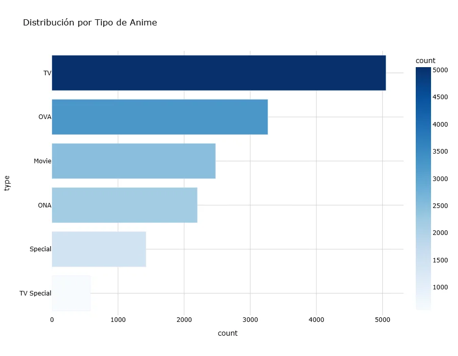

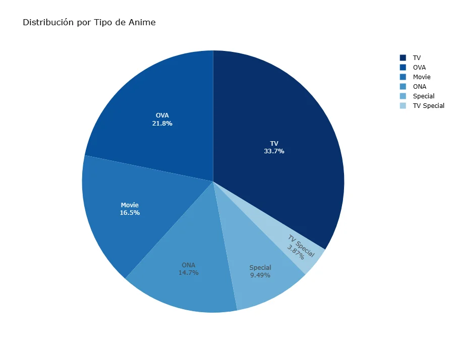

**Insights:**
- **TV domina** con 33.7% del dataset (~5,000 títulos)
- **OVA** es el segundo más común (21.8%)
- **TV Special** es el formato menos común (3.6%)

---

### 3. Distribución por Categoría de Género

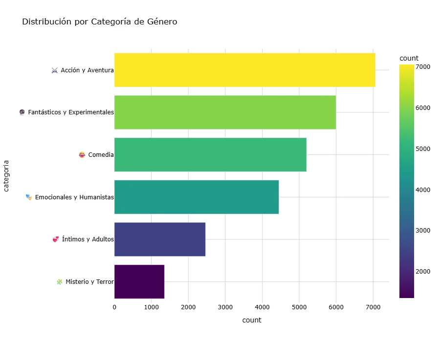

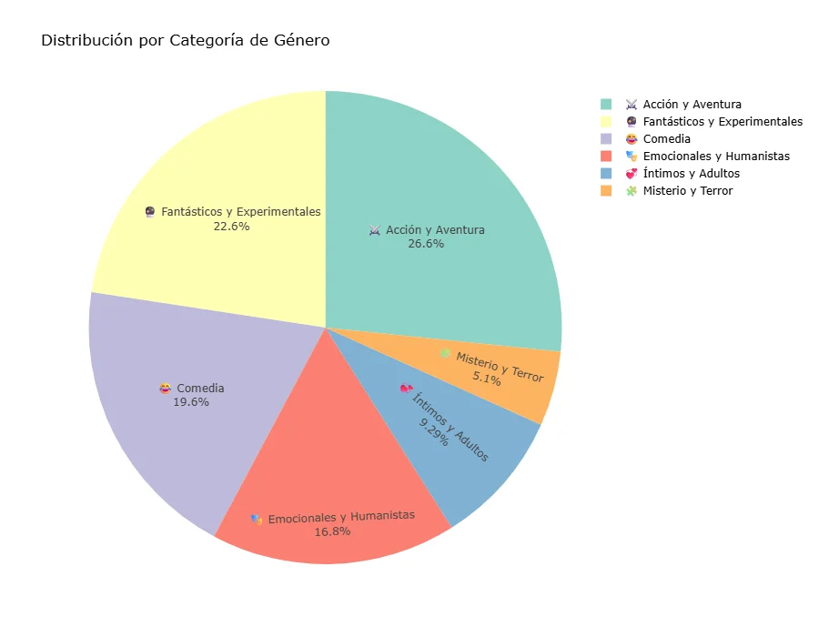

**Las 6 categorías temáticas:**
1. ⚔️ **Acción y Aventura** - 26.6% (más común)
2. 🔮 **Fantásticos y Experimentales** - 22.6%
3. 😂 **Comedia** - 19.6%
4. 🎭 **Emocionales y Humanistas** - 16.8%
5. 💞 **Íntimos y Adultos** - 9.2%
6. 🧩 **Misterio y Terror** - 5.1% (menos común)

---

### 4. Cantidad de Categorías por Anime

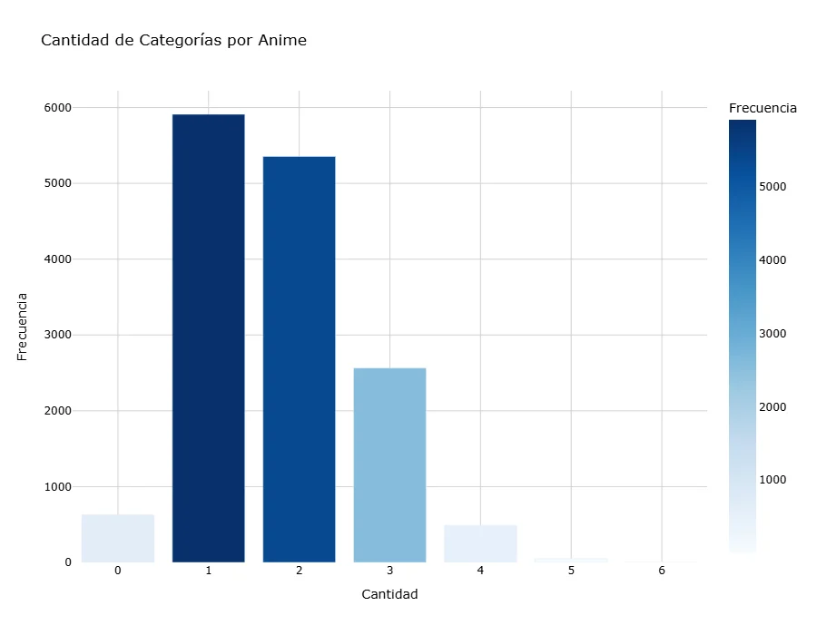

**Insights:**
- La mayoría de anime tiene **1 o 2 categorías** asignadas
- ~6,000 anime tienen **exactamente 1 categoría**
- ~5,300 anime tienen **2 categorías**
- Muy pocos tienen más de 3 categorías

---

## 📊 Análisis Bivariado

### 5. Score Promedio por Tipo

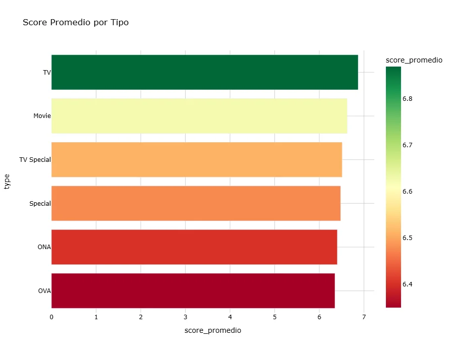

**Ranking de Tipos por Score:**
1. 🏆 **TV** - 6.91 (mejor calificado)
2. **Movie** - 6.71
3. **TV Special** - 6.63
4. **Special** - 6.54
5. **ONA** - 6.36
6. **OVA** - 6.33 (peor calificado)

**Conclusión importante:** TV supera a Movies en promedio, lo cual es contraintuitivo.

---

### 6. Distribución de Score por Tipo (Boxplot)

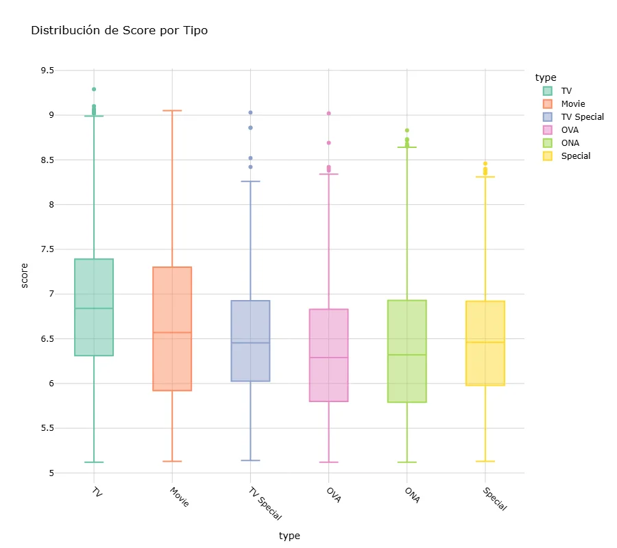

**Insights:**
- **TV** tiene la mediana más alta (~6.9)
- **TV** también produce más outliers superiores (masterpieces)
- **OVA** tiene la mayor concentración de scores bajos
- Todos los formatos tienen outliers superiores por encima de 8.5

---

### 7. Score Promedio por Categoría

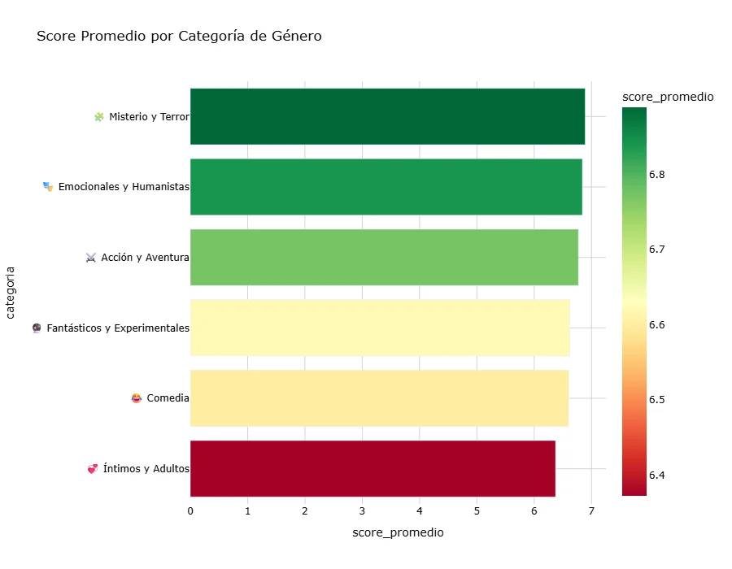

**Ranking de Categorías por Score:**
1. 🏆 **Misterio y Terror** - 7.04 (mejor calificado)
2. **Emocionales y Humanistas** - 6.92
3. **Acción y Aventura** - 6.81
4. **Fantásticos y Experimentales** - 6.69
5. **Comedia** - 6.64
6. **Íntimos y Adultos** - 6.41 (techo estructural)

**Conclusión:** Misterio domina en calidad a pesar de ser la categoría menos común.

---

### 8. Distribución de Score por Categoría (Boxplot)

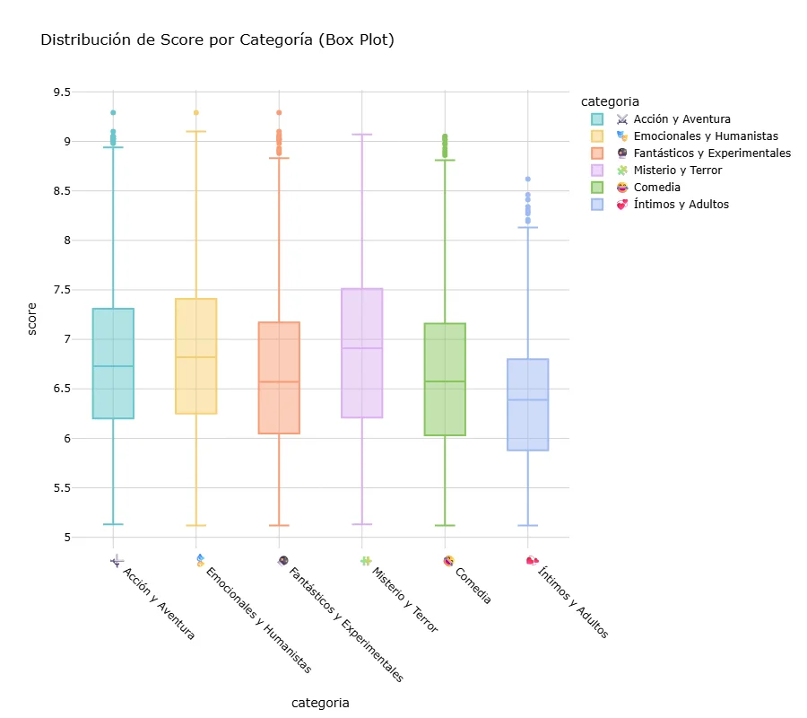

**Insights:**
- **Misterio y Terror** tiene la mediana más alta (~7.0)
- **Íntimos y Adultos** tiene scores consistentemente bajos
- **Emocionales y Humanistas** tiene alta variabilidad
- Todas las categorías producen outliers superiores (masterpieces)

---

## 🔥 Análisis Multivariado: Type × Categoría

### 9. Heatmap: Score por Tipo × Categoría

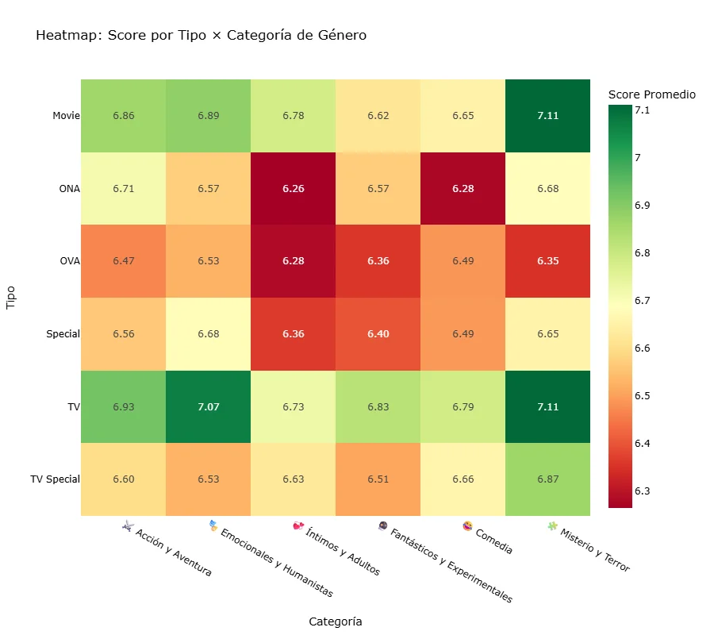

**Top 3 Combinaciones (Score ≥ 7.0):**
1. 🏆 **Movie + Misterio y Terror** - 7.11
2. 🏆 **TV + Misterio y Terror** - 7.11
3. 🏆 **TV + Emocionales y Humanistas** - 7.07

**Peores 3 Combinaciones (Score < 6.3):**
1. ❌ **ONA + Íntimos y Adultos** - 6.26
2. ❌ **OVA + Íntimos y Adultos** - 6.28
3. ❌ **OVA + Misterio y Terror** - 6.35

**Conclusión:** Las interacciones Type × Categoría son significativas. El formato influye en cómo funcionan las categorías.

---

### 10. Gráfico de Barras Agrupadas

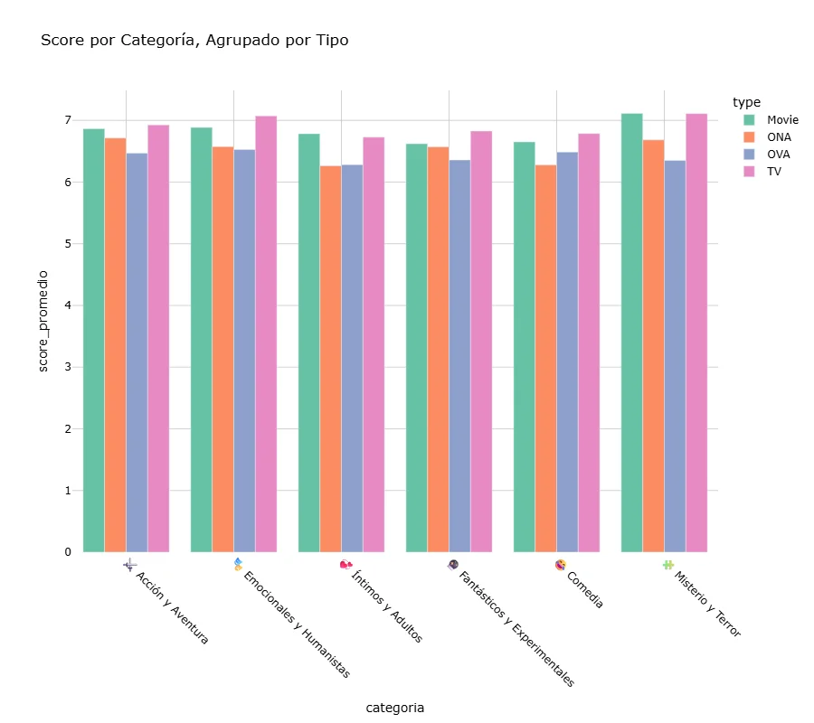

**Insights visuales:**
- En casi todas las categorías, **TV (rosa) tiene las barras más altas**
- **OVA (morado) y ONA (naranja) consistentemente tienen barras más bajas**
- En **Misterio y Terror**, TV y Movie tienen scores casi idénticos
- La brecha entre formatos es más pronunciada en **Comedia**

---

### 11. Boxplot Multivariable

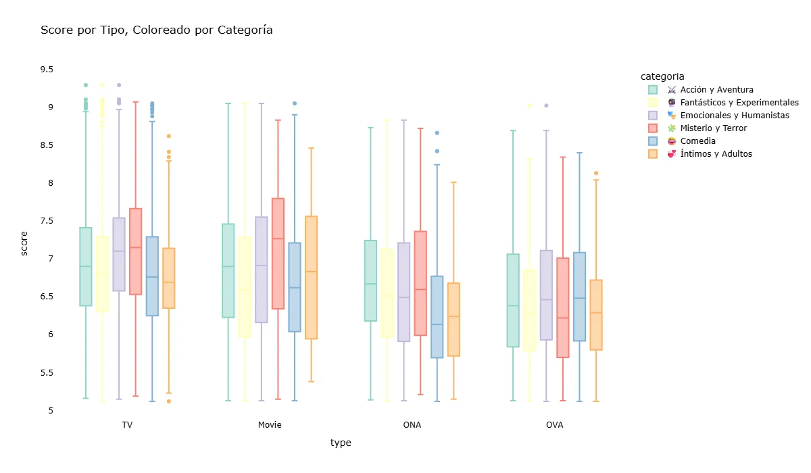

**Insights:**
- **TV + Misterio** (naranja en TV) muestra alta mediana y poca variabilidad → Apuesta segura
- **ONA + Íntimos** (naranja en ONA) muestra scores bajos y consistentes
- **Movie** tiene mayor variabilidad en general → Mayor riesgo pero también mayor reward
- Los outliers superiores están distribuidos en todos los tipos, pero concentrados en TV

---

## 🎯 Análisis de Outliers (Masterpieces)

### 12. Heatmap de Outliers Superiores (Score ≥ 8.95)

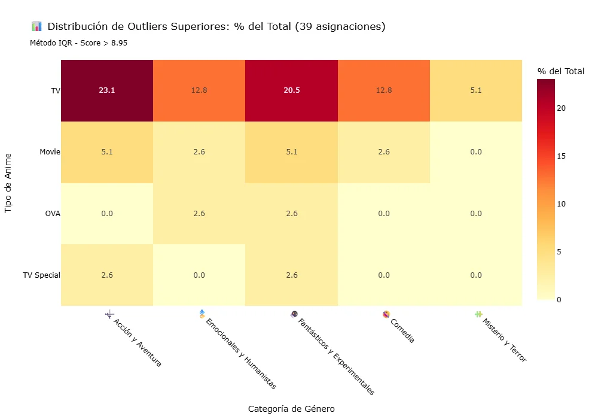

**Distribución de Outliers por Tipo:**
- **TV** - 72% (28 de 39 masterpieces) 🏆
- **Movie** - 15% (6 masterpieces)
- **OVA** - 5% (2 masterpieces)
- **TV Special** - 5% (2 masterpieces)
- **ONA** - 2.5% (1 masterpiece)

**Distribución de Outliers por Categoría:**
- ⚔️ **Acción y Aventura** - 23.1% (más masterpieces)
- 🔮 **Fantásticos y Experimentales** - 20.5%
- 🎭 **Emocionales y Humanistas** - 12.8%
- 🧩 **Misterio y Terror** - 5.1%

**Conclusión:** TV + Acción es la combinación que más masterpieces produce.

---

## 💡 Conclusiones Principales

### ✅ Hallazgos Clave

1. **TV es el formato premium**
   - Score promedio más alto (6.91)
   - Genera 72% de los masterpieces
   - Consistentemente supera a otros formatos

2. **Misterio y Terror es el género premium**
   - Score más alto de todas las categorías (7.04)
   - Funciona bien tanto en TV como en Movies
   - Baja producción pero alta calidad

3. **Las interacciones Type × Categoría son significativas**
   - No son efectos independientes
   - Ciertas combinaciones son ganadoras (TV+Misterio, TV+Emocionales)
   - Otras son perdedoras consistentes (OVA/ONA+Íntimos)

4. **Íntimos y Adultos tiene techo estructural**
   - Score más bajo en todas las combinaciones
   - Difícil superar 6.5 de promedio
   - Posiblemente por estigma o audiencia limitada

5. **Volumen ≠ Calidad**
   - Acción tiene más volumen (26.6%) pero no el mejor score
   - Misterio tiene menos volumen (5.1%) pero mejor score
   - Trade-off entre alcance y calidad

---

## 🎯 Recomendaciones

### Para Productores - Alta Calidad:
1. ✅ Produce **TV Series** de **Misterio y Terror** (Score: 7.11)
2. ✅ Considera **Movies** de **Fantásticos** (Score: 6.78)
3. ❌ Evita **OVA/ONA** para géneros premium

### Para Productores - Alto Volumen:
1. ✅ Enfócate en **Acción y Aventura** (26.6% del mercado)
2. ✅ Usa formato **TV** (mayor alcance, 33.7%)
3. ✅ Diversifica con **Comedia** (audiencia amplia)

### Para Analistas:
1. Realizar análisis confirmatorio (Two-way ANOVA)
2. Investigar variables omitidas (presupuesto, estudio, año)
3. Análisis temporal (¿las tendencias son estables?)
4. Modelado predictivo (Random Forest, XGBoost)

---

## 🛠️ Tecnologías Utilizadas

- **Python 3.11+**
- **Pandas 2.2.0** - Manipulación de datos
- **Plotly 5.18.0** - Visualizaciones interactivas
- **NumPy 1.26.3** - Operaciones numéricas
- **SciPy 1.12.0** - Análisis estadístico
- **Jupyter Notebook** - Análisis interactivo

---

## 📁 Estructura del Proyecto

```
anime-eda-project/
├── data/
│   ├── raw/                          # Dataset original
│   └── processed/                    # Datasets procesados
├── notebooks/
│   ├── anime_eda_analysis.ipynb      # Notebook interactivo
│   └── ANALYSIS_STATIC.md            # Esta versión estática
├── visualizations/                   # 12 gráficas PNG
└── README.md                         # Documentación principal
```

---

## 📊 Datasets Procesados

1. **anime_clean.csv** - Dataset limpio (14,XXX registros)
2. **anime_categorized.csv** - Con columna de categorías (14,XXX registros)

---

## 🔗 Enlaces

- 📓 [Notebook Interactivo](anime_eda_analysis.ipynb)
- 📄 [README Principal](../README.md)
- 🌐 [Ver en NBViewer](https://nbviewer.org/) (para gráficas interactivas)

---

## 📚 Metodología Completa

### 1. Carga de Datos
- Dataset de 15,000 anime de MyAnimeList
- 24 columnas originales

### 2. Limpieza
- Eliminación de columnas con >20% nulos
- Imputación (media para numéricos, moda para categóricos)
- Eliminación de duplicados

### 3. Categorización
- Reducción de 22 géneros a 6 categorías temáticas
- Basado en análisis semántico

### 4. Análisis
- **Univariado:** Distribuciones, estadísticos
- **Bivariado:** Type vs Score, Categoría vs Score
- **Multivariado:** Interacciones Type × Categoría
- **Outliers:** Identificación de masterpieces (IQR)

### 5. Visualización
- 12 gráficas profesionales con Plotly
- Exportadas a PNG para visualización estática

---

## 👤 Autor

**[Tu Nombre]**
- GitHub: [@tu-usuario](https://github.com/tu-usuario)
- LinkedIn: [Tu Perfil](https://linkedin.com/in/tu-perfil)
- Email: tuemail@ejemplo.com

---

## 📄 Licencia

Este proyecto está bajo la Licencia MIT.

---

<p align="center">
  <b>📊 Versión Estática - Optimizada para GitHub</b><br>
  Para gráficas interactivas, ejecuta el notebook localmente o usa NBViewer
</p>

---

**Nota:** Esta es una versión estática en Markdown del análisis completo. Para la experiencia interactiva con gráficas de Plotly, consulta el notebook Jupyter original.
